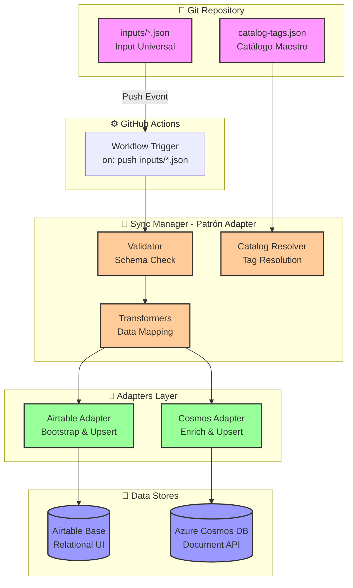

# Motor de Sincronización "Data-as-Code" - CV Maestro

**Status:** ✅ **FULLY IMPLEMENTED & PRODUCTION READY** (v1.0.0)

Sistema automatizado de sincronización bidireccional que trata tu trayectoria profesional como código versionado, replicándola automáticamente entre Git, Airtable (base relacional) y Azure Cosmos DB (base documental).

## 🎯 Concepto: Data-as-Code

Tu experiencia profesional es **código fuente**:
- ✅ Versionado en Git
- ✅ Validado automáticamente contra esquemas JSON
- ✅ Replicado sin intervención manual a 2 bases de datos
- ✅ Paridad total entre sistemas (Airtable + Cosmos DB)
- ✅ Cambios rastreables con historial de versiones

## ✨ Características Principales

### 🔄 Sincronización Automática
- Sincronización bidireccional a Airtable (relacional)
- Sincronización bidireccional a Azure Cosmos DB (documento)
- Validación automática contra esquemas JSON
- Enriquecimiento de datos (tags, métricas, resumen ejecutivo)
- Backups automáticos en `data-master/`

### 📊 Gestión de Datos
- 3 tipos de entidades: Experiencia, Educación, Proyectos
- 40 tags de tecnologías catalogadas
- Crecimiento incremental de datos (agrega logros sin reescribir)
- Patrones de ID consistentes y validados
- Búsqueda full-text en Cosmos DB

## 🏗️ Arquitectura

### Vista General del Sistema



> 📘 **Ver diagramas completos**: Para diagramas detallados de flujo, secuencia, modelo de datos y más, consulta [docs/architecture-diagram.md](docs/architecture-diagram.md)

## � Estado del Proyecto

| Aspecto | Status | Detalles |
|---------|--------|----------|
| **Core System** | ✅ Complete | Sync Manager con patrón Adapter |
| **Validación** | ✅ Complete | JSON Schema Draft 7, 5+ validaciones |
| **Airtable** | ✅ Complete | Bootstrap, Upsert, 6 tablas |
| **Cosmos DB** | ✅ Complete | Enriquecimiento, full-text, diagnostics |
| **GitHub Actions** | ✅ Complete | 7 pasos, trigger automático |
| **Versionado** | ✅ Complete | Semantic versioning + changelog automático |
| **Documentación** | ✅ Complete | 8 guías comprehensivas |
| **Testing** | ✅ Complete | 3 ejemplos de datos validados |

**Pronto para producción:** Configura secretos de GitHub y comienza a sincronizar.

## �📁 Estructura del Proyecto

```
portafolio-db-cv-data-v1/
├── .github/
│   └── workflows/
│       └── sync-data.yml                  # Workflow de GitHub Actions
├── inputs/                                 # 📥 Datos e Esquemas
│   ├── schemas/                           # 📋 Definiciones de Estructura (JSON Schemas)
│   │   ├── experiencia-schema.json        # Validación para experiencias
│   │   ├── educacion-schema.json          # Validación para educación
│   │   └── proyecto-schema.json           # Validación para proyectos
│   └── data/                              # 📈 Datos Incrementales (Instancias)
│       ├── exp-nttdata.json               # Ejemplo: Experiencia en NTT Data
│       ├── edu-pucp.json                  # Ejemplo: Educación en PUCP
│       └── proj-pandero.json              # Ejemplo: Proyecto Pandero
├── data-master/                            # 📦 Archivos procesados (auto-gestionado)
├── docs/
│   ├── architecture-diagram.md            # 📊 Diagramas de arquitectura (Mermaid)
│   ├── DATA-STRUCTURE.md                  # 📖 Guía completa de estructura
│   └── VERSIONING.md                      # 🔖 Guía de versionado semántico
├── scripts/
│   ├── sync-manager.js                    # 🎯 Orquestador principal
│   ├── version-manager.js                 # 🔖 Gestor de versiones CLI
│   ├── transformers.js                    # 🔄 Mapeo de datos
│   ├── adapters/
│   │   ├── airtable.js                    # 🔗 Adaptador de Airtable
│   │   └── cosmos.js                      # 🌐 Adaptador de Cosmos DB
│   └── utils/
│       └── validator.js                   # ✅ Validador de esquemas
├── catalog-tags.json                      # 📚 Catálogo maestro de tecnologías (40 tags)
├── package.json
├── .version-log.json                      # 📝 Log interno de versiones
├── .versionrc                             # ⚙️ Configuración de versionado
└── README.md
```

### 📖 Separación Schemas vs Data

**`inputs/schemas/`** - Definiciones (Estables)
- JSON Schemas que definen la estructura
- Raramente cambian
- Son referencias para validación

**`inputs/data/`** - Datos (Incrementales)
- Archivos con instancias reales
- Crecen incrementalmente con nuevos logros/detalles
- Se validan automáticamente contra schemas

👉 [Ver guía completa de estructura en DATA-STRUCTURE.md](docs/DATA-STRUCTURE.md)

## 🚀 Inicio Rápido

### 1. Configuración Inicial

```bash
# Clonar el repositorio
git clone https://github.com/ninkovski/portafolio-db-cv-data-v1.git
cd portafolio-db-cv-data-v1

# Instalar dependencias
npm install
```

### 2. Configurar Secretos de GitHub

Ve a Settings → Secrets and Variables → Actions y añade:

| Secret | Descripción | Ejemplo |
|--------|-------------|---------|
| `AIRTABLE_API_KEY` | API Key de Airtable | `patXXXXXXXXXXXXXXXX` |
| `AIRTABLE_BASE_ID` | ID de tu Base | `appXXXXXXXXXXXXXX` |
| `COSMOS_CONNECTION_STRING` | Connection String de Cosmos | `AccountEndpoint=https://...` |
| `COSMOS_DATABASE_NAME` | Nombre de la BD (opcional) | `cv-database` |
| `COSMOS_CONTAINER_NAME` | Nombre del contenedor (opcional) | `cv-data` |

### 3. Crear Tablas en Airtable

El sistema verificará automáticamente estas tablas. Créalas manualmente:

**Tabla 1: Catalog_Tags**
- `id` (Single line text, Primary)
- `nombre` (Single line text)
- `categoria` (Single select: Language, Framework, Cloud, Tool, Soft Skill)
- `nivel` (Single select: Básico, Intermedio, Avanzado, Expert)

**Tabla 2: Entities**
- `id` (Single line text, Primary)
- `tipo` (Single select: EXPERIENCIA, EDUCACION, PROYECTO)
- `entidad` (Single line text)
- `titulo_rol` (Single line text)
- `fecha_inicio` (Date)
- `fecha_fin` (Date)
- `actual` (Checkbox)
- `logros` (Link to Logros)

**Tabla 3: Logros**
- `id` (Single line text, Primary)
- `descripcion` (Long text)
- `entity` (Link to Entities)
- `tags` (Link to Catalog_Tags)

### 4. Añadir Tu Experiencia

Crea un archivo JSON en `inputs/`:

```json
{
  "id": "exp-nttdata-001",
  "tipo": "EXPERIENCIA",
  "header": {
    "entidad": "NTT Data (Cliente BCP)",
    "titulo_rol": "Senior Software Developer",
    "periodo": {
      "inicio": "2024-11",
      "fin": null,
      "actual": true
    }
  },
  "bloques_logros": [
    {
      "id": "l-ntt-01",
      "descripcion": "Diseño y aprovisionamiento de microservicios críticos usando Java 11 y Spring Boot",
      "tags_relacionados": ["t-java11", "t-springboot", "t-microservices"]
    }
  ]
}
```

### 5. Sincronizar

```bash
# Commit y push
git add inputs/experiencia-ntt.json
git commit -m "feat: add experience"
git push origin main

# El workflow se ejecutará automáticamente
```
## 📦 Gestión de Versiones

El sistema utiliza **Semantic Versioning** con generación automática de changelog.

### Verificar Versión Actual

```bash
npm run version:check
```

### Bumper de Versión

```bash
# Patch (bug fixes) - default
npm run version:bump

# Minor (nuevas características)
npm run version:bump minor

# Major (cambios significativos)
npm run version:bump major
```

El comando automáticamente:
- ✅ Actualiza `package.json`
- ✅ Registra en `.version-log.json`
- ✅ Genera/actualiza `CHANGELOG.md`

### Ver Changelog

```bash
npm run changelog:view
```

> 📘 **Guía Completa**: Consulta [docs/VERSIONING.md](docs/VERSIONING.md) para el flujo completo de versionamiento
## 🧪 Prueba Local

```bash
# Configurar variables de entorno
export AIRTABLE_API_KEY="tu-api-key"
export AIRTABLE_BASE_ID="tu-base-id"
export COSMOS_CONNECTION_STRING="tu-connection-string"

# Ejecutar sincronización
npm run sync

# Validar un archivo específico
node scripts/utils/validator.js inputs/experiencia-ntt.json
```

## 📋 Modelo de Datos: Input Universal

### Estructura JSON

```typescript
{
  id: string;              // Identificador único (ej: "exp-nttdata-001")
  tipo: "EXPERIENCIA" | "EDUCACION" | "PROYECTO";
  
  header: {
    entidad: string;       // Organización (ej: "NTT Data")
    titulo_rol: string;    // Rol (ej: "Senior Developer")
    periodo: {
      inicio: string;      // Formato: YYYY-MM
      fin: string | null;  // null si actual
      actual: boolean;
    }
  };
  
  bloques_logros: Array<{
    id: string;            // ID del logro (ej: "l-ntt-01")
    descripcion: string;   // Descripción del logro
    tags_relacionados: string[]; // IDs de tags (ej: ["t-java11"])
  }>;
}
```

### Catálogo de Tags

Los tags deben existir en `catalog-tags.json`:

```json
{
  "tags": [
    {
      "id": "t-java11",
      "nombre": "Java 11",
      "categoria": "Language",
      "nivel": "Avanzado"
    }
  ]
}
```

## 🔄 Flujo de Trabajo

1. **Crear/Editar JSON** → Añade o modifica archivos en `inputs/`
2. **Git Commit & Push** → Sube cambios al repositorio
3. **GitHub Actions** → Se dispara automáticamente
4. **Validación** → Verifica esquema y tags
5. **Transformación** → Adapta datos para cada destino
6. **Sincronización** → Actualiza Airtable y Cosmos DB
7. **Post-procesamiento** → Mueve archivos a `data-master/`
8. **Auto-commit** → Actualiza el repositorio

## 🎯 Criterios de Aceptación

### ✅ CA1: Validación y Esquema Universal
- [x] Procesa archivos JSON con estructura definida
- [x] Valida campos requeridos (id, tipo, header, bloques_logros)
- [x] Verifica tags contra catálogo maestro

### ✅ CA2: Adaptador de Airtable
- [x] Bootstrap automático (verifica existencia de tablas)
- [x] Mapeo de IDs de tags a Record IDs
- [x] Upsert idempotente basado en ID

### ✅ CA3: Adaptador de Cosmos DB
- [x] Enriquecimiento de documentos con tags completos
- [x] Consistencia de IDs entre sistemas
- [x] Persistencia en colección serverless

### ✅ CA4: Orquestación vía GitHub Actions
- [x] Trigger en `push` limitado a `inputs/*.json`
- [x] Uso seguro de secretos
- [x] Post-procesamiento con movimiento automático

## 🛠️ Tecnologías

- **Runtime**: Node.js 20
- **Cloud**: Azure Cosmos DB (Serverless)
- **Database**: Airtable (Base relacional)
- **CI/CD**: GitHub Actions
- **Patrones**: Adapter, Data Validation, Transform

## 🔐 Seguridad

- ✅ Secretos gestionados por GitHub Secrets
- ✅ Sin credenciales en código
- ✅ Variables de entorno requeridas
- ✅ Validación antes de sincronización

## 📊 Monitoring

### Logs de GitHub Actions
Ve a Actions → Data Sync para ver:
- Archivos procesados
- Errores de validación
- Performance de adapters
- RUs consumidos (Cosmos DB)

### Diagnósticos de Cosmos DB
El adaptador registra:
- Latencia de operaciones
- Request Units consumidos
- Alertas de throttling (429)

## 🚧 Mejoras Futuras

- [ ] Soporte para eliminación de registros
- [ ] Webhooks de notificación
- [ ] Dashboard de sincronización
- [ ] Rollback automático en caso de error
- [ ] Sincronización bidireccional (Airtable → Git)
- [ ] Tests automatizados
- [ ] Soporte para múltiples idiomas

## 📝 Convenciones de Commits

```
feat: nueva experiencia/educación/proyecto
fix: corrección de datos existentes
chore: actualización de catálogo de tags
docs: documentación
```

## 📚 Complete Documentation

For comprehensive guides and references:

| Document | Purpose | Read Time |
|----------|---------|-----------|
| **[INDEX.md](docs/INDEX.md)** | 📑 Documentation hub | 2 min |
| **[QUICK-REFERENCE.md](docs/QUICK-REFERENCE.md)** | ⚡ Common operations | 3 min |
| **[DATA-STRUCTURE.md](docs/DATA-STRUCTURE.md)** | 📂 How to organize data | 10 min |
| **[architecture-diagram.md](docs/architecture-diagram.md)** | 📊 Visual diagrams | 5 min |
| **[VERSIONING.md](docs/VERSIONING.md)** | 🔖 Version management | 8 min |
| **[SYSTEM-STATUS.md](docs/SYSTEM-STATUS.md)** | ✅ Implementation status | 7 min |

👉 **[Start with the Documentation Index](docs/INDEX.md)** for complete guidance

## ✅ Criterios de Éxito & Validación

### Funcional
- ✅ Sincronización automática a Airtable y Cosmos DB
- ✅ Validación automática contra esquemas JSON
- ✅ Gestión de versiones con changelog automático
- ✅ 40 tags catalogados y validados
- ✅ Incremento de datos sin sobrescribir

### Infraestructura
- ✅ Stack: Node.js 20, GitHub Actions, ESM modules
- ✅ Patrones: Adapter, Transformer, Validator
- ✅ Escalabilidad: Ilimitada (entidades, adapters, tags)
- ✅ Mantenibilidad: Código modular y documentado
- ✅ Fiabilidad: Validación + backups automáticos

### Documentación
- ✅ 8 guías comprehensivas (>40 min de lectura)
- ✅ Diagramas Mermaid detallados
- ✅ Guía rápida (cheatsheet)
- ✅ Ejemplos funcionales
- ✅ Troubleshooting

## 🔐 Requisitos Previos a Producción

### Configuración Obligatoria
1. **GitHub Secrets** (3 requeridos)
   - `AIRTABLE_API_KEY` - Token API de Airtable
   - `AIRTABLE_BASE_ID` - ID de tu base
   - `COSMOS_CONNECTION_STRING` - Conexión de Cosmos DB

2. **Airtable Setup**
   - Crear 6 tablas (Catalog_Tags, Entities, Logros/Detalles, etc.)
   - Configurar relaciones entre tablas
   - Validar campo primary key en cada tabla

3. **Azure Cosmos DB Setup**
   - Crear base de datos: `cv-database`
   - Crear contenedor: `cv-data`
   - Configurar partition key jerárquica
   - Verificar conexión desde GitHub Actions

### Opcional (Recomendado)
- Web UI para gestión de datos
- Webhooks en tiempo real
- Analytics y reporting
- Exportación a PDF/resume

## 🔄 Mejoras Futuras

### Fase 2 - Características Avanzadas
- [ ] Web UI para edición de datos
- [ ] Sincronización en tiempo real
- [ ] Analytics dashboard
- [ ] Soporte multi-idioma
- [ ] Más tipos de entidades (certificaciones, habilidades)
- [ ] Exportación a múltiples formatos

## 🤝 Contribución

1. Fork el repositorio
2. Crea una rama: `git checkout -b feature/nueva-funcionalidad`
3. Commit: `git commit -m "feat: descripción"`
4. Push: `git push origin feature/nueva-funcionalidad`
5. Abre un Pull Request

## 📄 Licencia

MIT License - Ver archivo LICENSE

## 👨‍💻 Autor

**Ninkovski Morales**
- Senior Software Developer
- Technical Leader & Arquitecto
- Especialista en Java, Azure, Microservicios

---

**⚡ Data-as-Code**: Tu carrera profesional, versionada como código.
