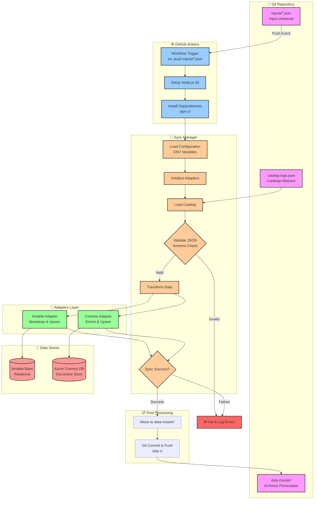
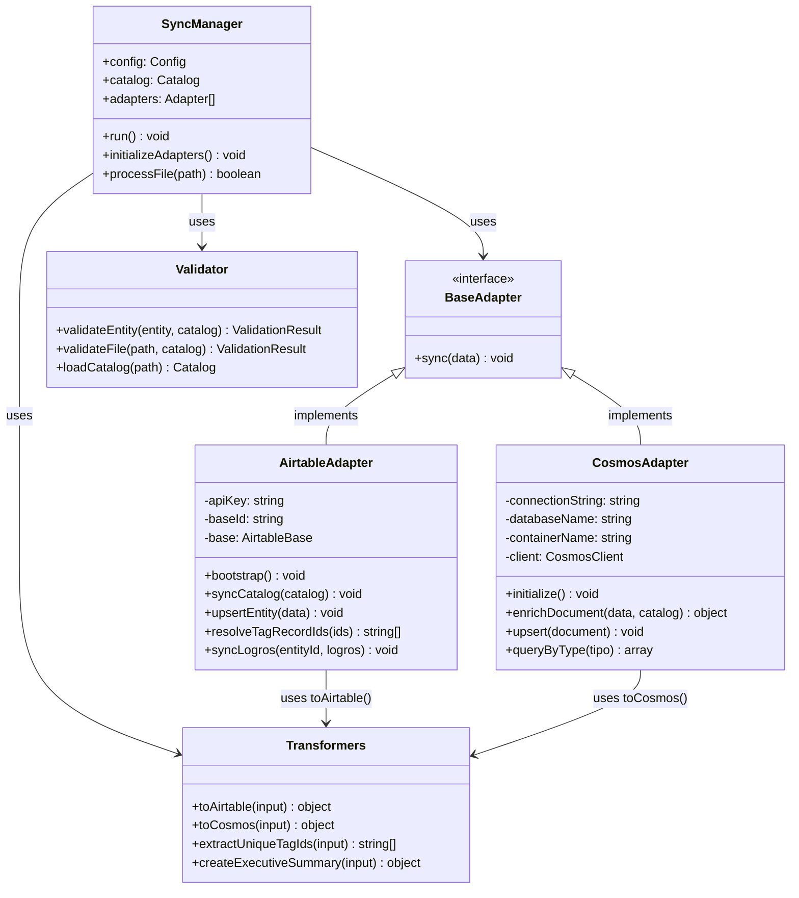
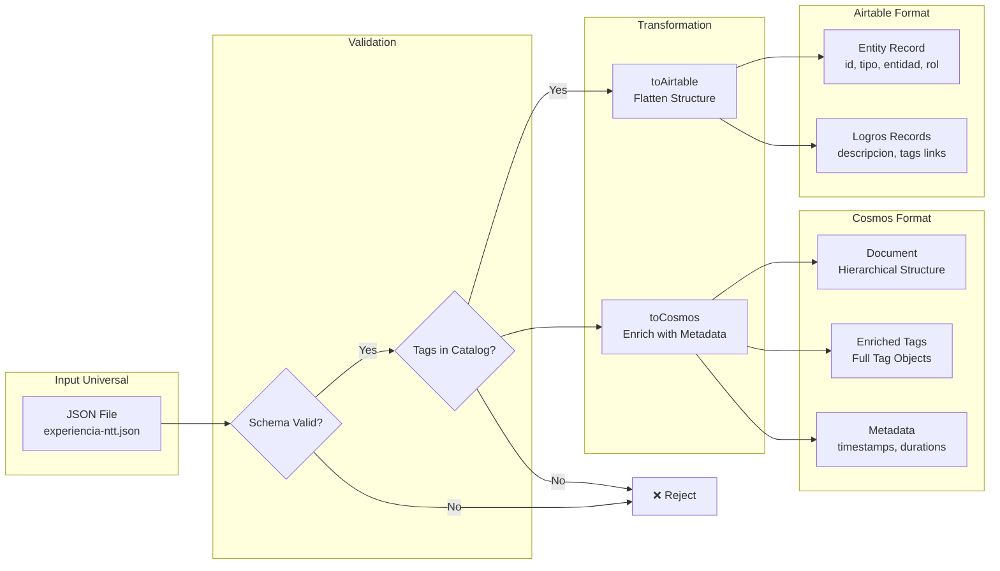
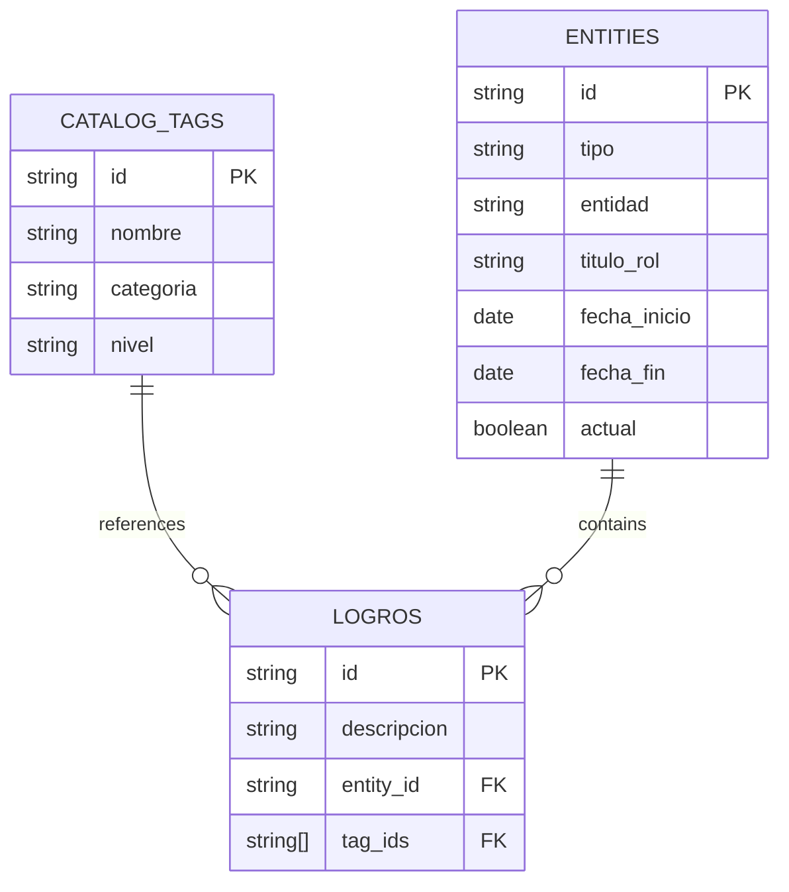
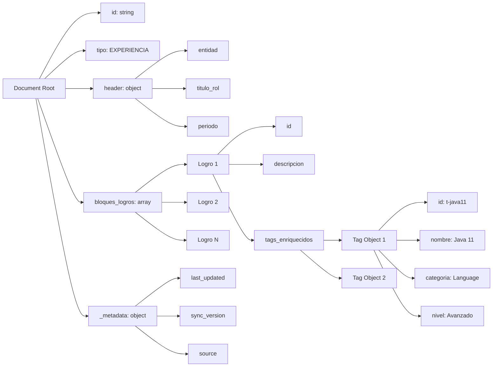
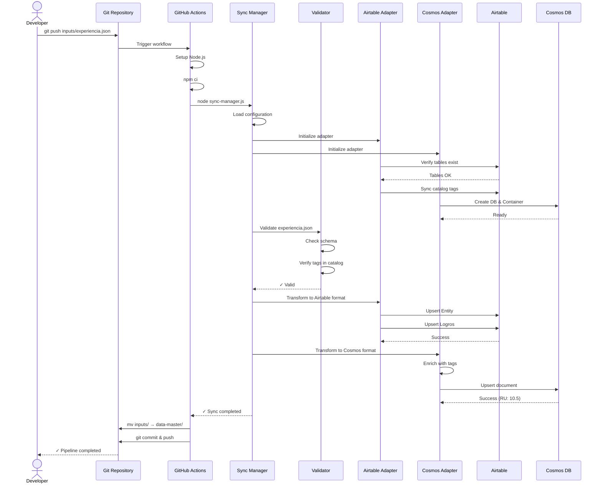
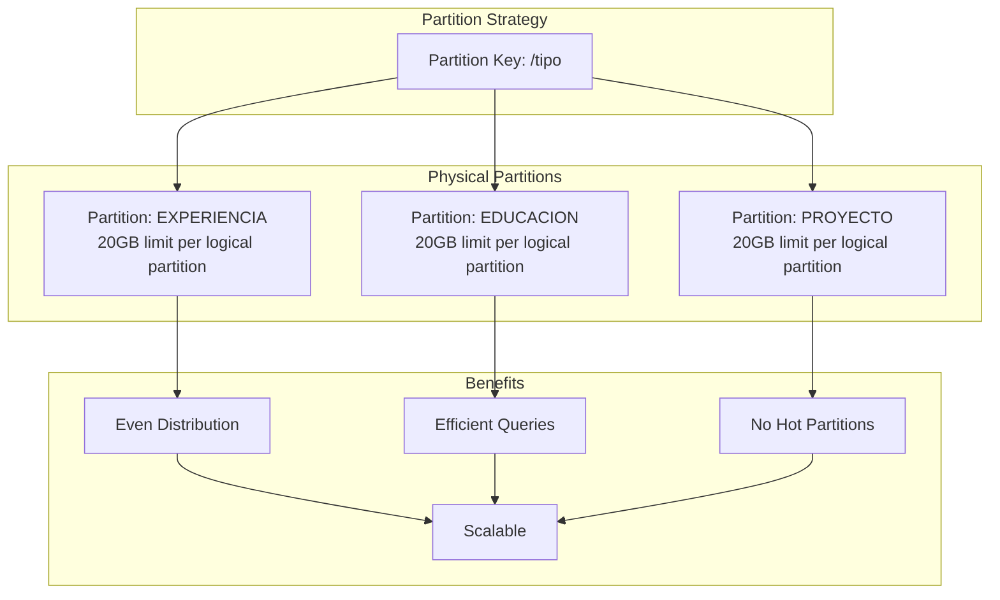
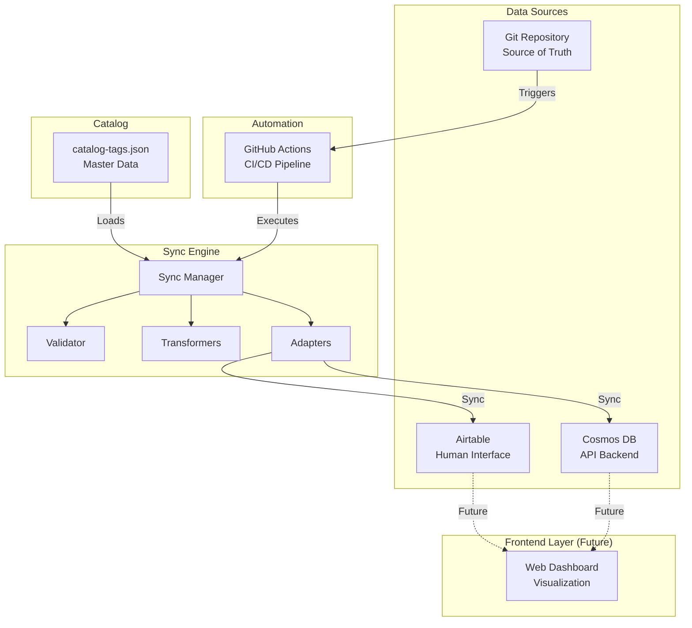

# Diagrama de Arquitectura - Motor de Sincronización Data-as-Code

## Flujo Principal de Sincronización

## Patrón Adapter - Vista Detallada

## Flujo de Transformación de Datos

## Modelo de Datos - Relacional vs Documental

### Cosmos DB Document Structure

## Secuencia de Sincronización Completa

## Estrategia de Particionamiento en Cosmos DB

## Diagrama de Componentes del Sistema

---

## Leyenda de Símbolos

- 🔄 **Adapters**: Conectores específicos para cada plataforma
- ✅ **Validator**: Verificación de esquemas y datos
- 🔀 **Transformers**: Mapeo entre formatos
- 📊 **Catalog**: Diccionario maestro de tags
- 💾 **Data Stores**: Bases de datos destino
- ⚙️ **Automation**: GitHub Actions
- 📂 **Git**: Sistema de versionamiento

## Referencias

- [Azure Cosmos DB Best Practices](https://learn.microsoft.com/azure/cosmos-db/)
- [Airtable API Documentation](https://airtable.com/developers/web/api/introduction)
- [GitHub Actions Workflow Syntax](https://docs.github.com/actions/using-workflows/workflow-syntax-for-github-actions)
